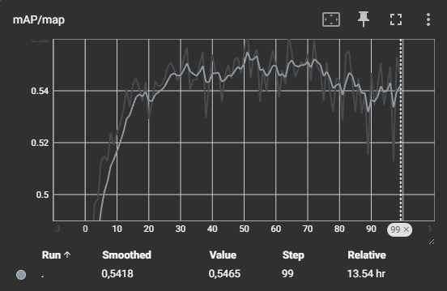
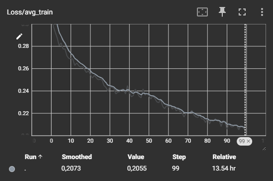

# sarscope_detection


## About

This repository is about detect ship in SAR image (https://en.wikipedia.org/wiki/Synthetic-aperture_radar)
The goal is to be able to detect and predict the class for each ship within one image. To do that, I used a FastRCNN model (https://arxiv.org/abs/1506.01497)

## Datas
I used an open source dataset in Kaggle: https://www.kaggle.com/datasets/kailaspsudheer/sarscope-unveiling-the-maritime-landscape

## Run the file:

You can download the file and use it like that, you will just need to change the path to data in the jupyter file
```base_path=YOUR_PATH```

## The training process
I used my personal GPU, a Nvidia GeForce RTX 4060 8Go RAM to train the model for 100 epoch.

\
\

The current best weights is at epoch 64 (starting from 0) with current metrics on the test data
  Metric                | Value                |
 |-----------------------|----------------------|
 | **map**               | 0.5436151623725891   |
 | **map_50**            | 0.843625545501709    |
 | **map_75**            | 0.6185094714164734   |
 | **map_small**         | 0.49138033390045166  |
 | **map_medium**        | 0.6922172904014587   |
 | **map_large**         | 0.6687196493148804   |
 | **mar_1**             | 0.25759682059288025  |
 | **mar_10**            | 0.562661349773407    |
 | **mar_100**           | 0.6185203790664673   |
 | **mar_small**         | 0.5695593953132629   |
 | **mar_medium**        | 0.7633684277534485   |
 | **mar_large**         | 0.734883725643158    |
 | **map_per_class**     | -1.0                 |
 | **mar_100_per_class** | -1.0                 |
 | **classes**           | 1                    |
